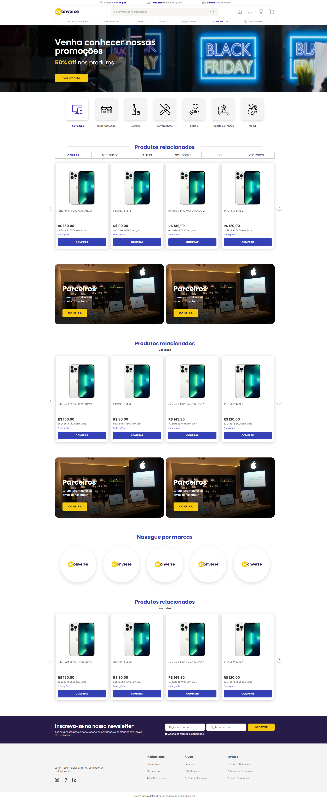

# Econverse — Teste Front-End

Página inicial de e-commerce de tecnologia, desenvolvida em **React e TypeScript** a partir de um layout no Figma. A vitrine consome uma lista de produtos de uma API externa, e a página foi construída com foco em **fidelidade ao design, componentização, acessibilidade, SEO e performance**.

🔗 **Site publicado:** https://econverse-front-end-beta.vercel.app



---

## Sumário

- [Funcionalidades](#funcionalidades)
- [Tecnologias](#tecnologias)
- [Como rodar](#como-rodar)
- [Como testar](#como-testar)
- [Estrutura de pastas](#estrutura-de-pastas)
- [Decisões técnicas](#decisões-técnicas)
- [SEO, acessibilidade e performance](#seo-acessibilidade-e-performance)
- [Próximos passos](#próximos-passos)

---

## Funcionalidades

- **Vitrine de produtos** consumindo o JSON da API, com carrossel, estados de carregamento e de erro.
- **Modal do produto** ao clicar em um card, com nome, preço, descrição, seletor de quantidade e botão de compra. Fecha pelo X, pela tecla Esc, clicando no fundo ou no botão "Comprar".
- **Página completa do layout:** header, banner principal, categorias, três vitrines, banners de parceiros, marcas, newsletter e rodapé.
- **Newsletter funcional** com validação nativa (campos obrigatórios, e-mail válido e aceite dos termos) e mensagem de sucesso.
- **Responsiva:** o layout do Figma é seguido no desktop e adaptado para notebooks, tablets e celulares.

## Tecnologias

| Ferramenta | Uso |
|---|---|
| **React 19 + TypeScript** | Interface e tipagem de todo o projeto |
| **Vite** | Ambiente de desenvolvimento, build e proxy da API |
| **Sass (SCSS Modules)** | Estilos isolados por componente, com tokens de design |
| **TanStack Query (React Query)** | Busca, cache e estados de carregamento/erro dos produtos |
| **ESLint + Prettier** | Padronização e qualidade do código |
| **Vercel** | Hospedagem e proxy da API em produção |

Não foi usada nenhuma biblioteca de UI (Bootstrap, Foundation etc.) nem de carrossel: todos os componentes foram feitos do zero.

## Como rodar

**Pré-requisitos:** Node.js 20.19+ (ou 22.12+) e npm.

```bash
# 1. Clonar o repositório
git clone https://github.com/RRodrigoCordeiro/teste-front-end.git
cd teste-front-end

# 2. Instalar as dependências
npm install

# 3. Rodar em modo de desenvolvimento
npm run dev
```

Acesse `http://localhost:5173`.

Para **compilar** o projeto (build de produção) e visualizar o resultado:

```bash
npm run build
npm run preview
```

Acesse `http://localhost:4173`.

> **Importante:** a API de produtos não permite requisições diretas do navegador (CORS). Por isso, o projeto usa um proxy, já configurado nos modos `dev` e `preview` do Vite e na Vercel. Abrir o arquivo `dist/index.html` direto no navegador não funciona: use sempre um dos comandos acima. Mais detalhes em [Decisões técnicas](#decisões-técnicas).

## Como testar

**Roteiro de teste:**

1. A vitrine exibe os 10 produtos da API, com preço e parcelamento formatados em reais.
2. As setas do carrossel avançam e voltam; no fim da lista, a seta correspondente fica desativada.
3. Clicar em um card (ou no botão "Comprar") abre o modal com os dados daquele produto.
4. No modal, o seletor de quantidade não permite valor menor que 1; o modal fecha pelo X, pela tecla Esc e clicando no fundo escuro.
5. Na newsletter, o envio é bloqueado com campos vazios, e-mail inválido ou termos não aceitos; com tudo preenchido, aparece a mensagem de sucesso.
6. Navegando só com o teclado (Tab, Enter, Esc), todos os elementos interativos recebem foco visível e funcionam.
7. Redimensionando a janela, o layout se adapta sem rolagem horizontal da página.

## Estrutura de pastas

```
public/
├── images/              # Imagens com endereço fixo (banner e imagem de compartilhamento)
├── favicon.svg
├── robots.txt
└── sitemap.xml
src/
├── assets/              # Logos, ícones e imagens processados pelo Vite
├── components/          # Um componente por pasta: .tsx + .module.scss + index.ts
│   └── ui/              # Componentes genéricos reutilizáveis (Button, SectionTitle, QuantitySelector)
├── hooks/               # useProducts (dados) e useCarousel (comportamento do carrossel)
├── lib/                 # Configuração de bibliotecas externas (QueryClient)
├── services/            # Comunicação com a API
├── styles/              # Tokens de design, mixins e estilos globais
├── types/               # Tipagens compartilhadas
├── utils/               # Funções auxiliares puras (formatação de preço)
├── App.tsx              # Composição da página
└── main.tsx             # Ponto de entrada
```

Cada camada tem uma responsabilidade única: o **service** só busca os dados, o **hook** conecta essa busca ao React e os **componentes** só exibem. Assim, os componentes não sabem de onde os dados vêm, e trocar a API ou a estratégia de cache não exige mexer na interface.

## Decisões técnicas

**Proxy por causa do CORS.** A API da Econverse bloqueia requisições feitas direto pelo navegador a partir de outro domínio. O front-end chama um caminho relativo (`/teste-front-end/...`), e quem repassa a chamada para a API é o servidor: o Vite em desenvolvimento (`vite.config.ts`) e a Vercel em produção (`vercel.json`). O código da aplicação é o mesmo nos dois ambientes.

**Preço em centavos.** O campo `price` do JSON é um inteiro (ex.: `14990`). Ele foi interpretado como centavos (`R$ 149,90`), o que gera valores coerentes para todos os produtos. A formatação usa `Intl.NumberFormat`, nativo do navegador, no padrão brasileiro.

**Sem preço "de" riscado.** O layout mostra um preço antigo riscado, mas o JSON não traz esse dado. Em vez de inventar um valor, o card exibe apenas o preço real. O parcelamento ("2x sem juros") é calculado a partir dele.

**Abas da vitrine sem filtro.** O JSON não tem campo de categoria, então as abas (Celular, Acessórios etc.) alteram apenas o destaque visual. Elas usam `aria-pressed` para comunicar o estado a leitores de tela.

**"Comprar" fecha o modal.** Como o projeto ainda não tem carrinho, o botão de compra do modal apenas o fecha. Os links institucionais, de redes sociais e de parceiros usam `href="#"` pelo mesmo motivo.

**TanStack Query em um hook próprio.** Para uma única requisição, um `useEffect` resolveria, mas o TanStack Query traz cache, cancelamento de requisição e estados de carregamento/erro prontos, além de preparar o projeto para filtros por categoria no futuro. Ele fica encapsulado no hook `useProducts`, então os componentes não dependem da biblioteca. As três vitrines compartilham **uma única requisição**.

**Carrossel sem biblioteca.** Usa a rolagem nativa do navegador com `scroll-snap`, o que garante arrastar com o dedo no celular sem código extra. O hook `useCarousel` controla as setas e usa `IntersectionObserver` para tirar a sombra dos cards fora da área visível, evitando que ela "vaze" para dentro da vitrine.

**Componentes reutilizáveis com variações por props.** A vitrine aparece três vezes com pequenas diferenças (`showCategories`, `showViewAll`); o `Button` tem variantes de cor e tamanho; o `SectionTitle` tem versão com e sem linhas laterais. O modal é único e controlado pela página, então qualquer vitrine pode abri-lo.

**Modal com `<dialog>` nativo.** O elemento já entrega fechamento com Esc, foco preso dentro do modal e devolução do foco ao fechar, com menos código e mais acessibilidade do que uma implementação com `<div>`.

**Tokens de design.** Cores, tipografia, raios, sombras e breakpoints extraídos do Figma ficam em `src/styles/_variables.scss`, com aliases semânticos (`$color-primary`, `$color-text`). Valores usados em um único componente ficam como variáveis locais dele.

**Ícones das categorias como máscara CSS.** No Figma, esses ícones são imagens, e não vetores. Eles foram convertidos em silhuetas WebP e aplicados com `mask-image`, o que permite trocar a cor pelo CSS (preto no estado normal, roxo-azulado no ativo) com um único arquivo por ícone.

**Padronização de detalhes do layout.** As abas da vitrine foram padronizadas em maiúsculas, seguindo a imagem de referência da vitrine, e os links da coluna "Termos" do rodapé usam a mesma fonte das outras colunas (Work Sans), mantendo as três colunas consistentes entre si.

**Responsividade desktop-first.** O Figma só tem a versão desktop. Os ajustes para telas menores entram por breakpoints (1364px, 1024px, 768px e 480px), sem alterar o layout original nas telas grandes. Em telas pequenas, faixas como o menu, as categorias e as marcas viram rolagem lateral, e as vitrines mantêm o carrossel para a página não ficar excessivamente longa.

## SEO, acessibilidade e performance

**Resultados do Lighthouse no site publicado:**

| Categoria | Desktop | Mobile |
|---|---|---|
| Performance | 99 | 96 |
| Acessibilidade | 96 | 96 |
| Boas práticas | 100 | 100 |
| SEO | 100 | 100 |

**SEO:** um único `<h1>` e títulos em ordem hierárquica; HTML semântico (`header`, `nav`, `main`, `section`, `article`, `footer`, `dialog`); `title`, `description` e URL canônica; tags Open Graph e Twitter com imagem de compartilhamento; `robots.txt` e `sitemap.xml`.

**Acessibilidade:** textos alternativos nas imagens (vazios nas decorativas); `aria-label` em botões e links que só têm ícone; rótulos nos campos de formulário (visualmente ocultos onde o layout não os mostra); foco visível em todos os elementos interativos; efeitos de hover aplicados apenas em dispositivos com mouse.

**Performance:** imagem do banner comprimida em WebP (de 592 KB para 41 KB) e pré-carregada no `index.html`; fontes carregadas sem bloquear a renderização e apenas com os pesos usados; imagens abaixo da primeira tela com `loading="lazy"`; `width` e `height` em todas as imagens para evitar deslocamentos de layout.

## Próximos passos

- **Testes automatizados:** testes unitários dos componentes com Vitest e Testing Library, e um teste de ponta a ponta do fluxo vitrine → modal.
- **Filtro por categoria:** com um campo de categoria na API, as abas da vitrine passariam a filtrar os produtos, usando a chave de cache do TanStack Query (`['products', categoria]`).
- **Carrinho de compras:** o botão "Comprar" e o seletor de quantidade do modal já estão prontos para se conectar a um carrinho.

---

Desenvolvido por **Rodrigo Cordeiro**.